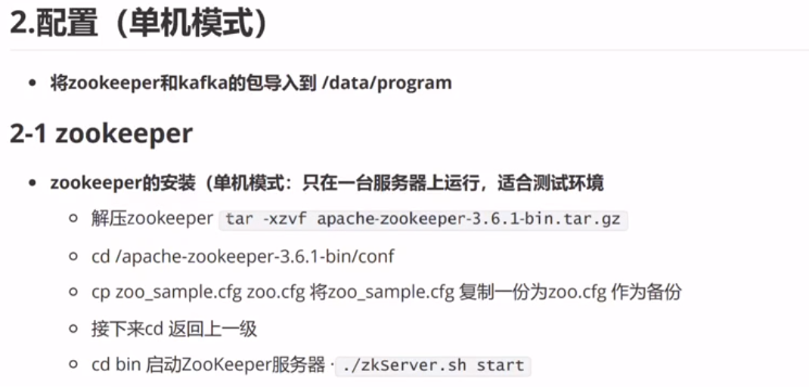
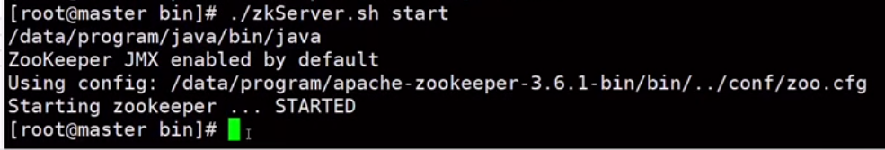
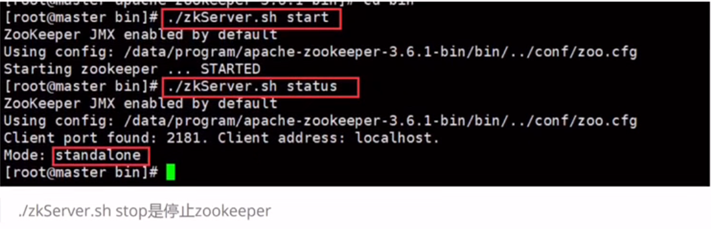
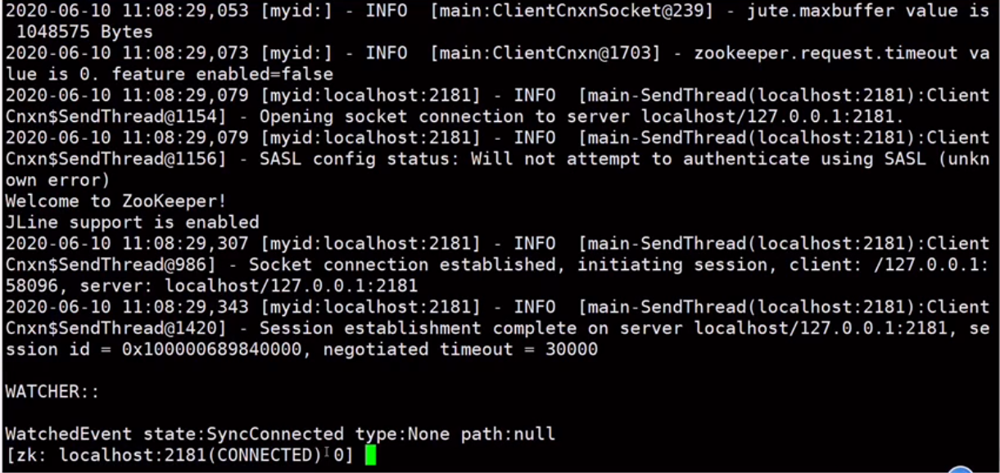
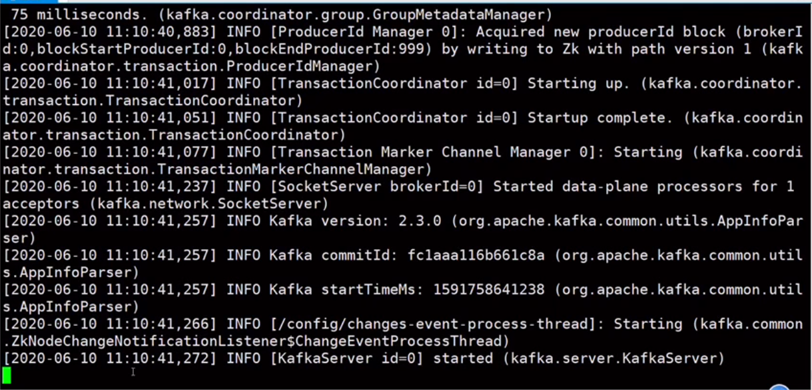
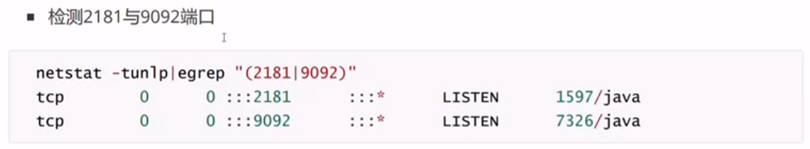
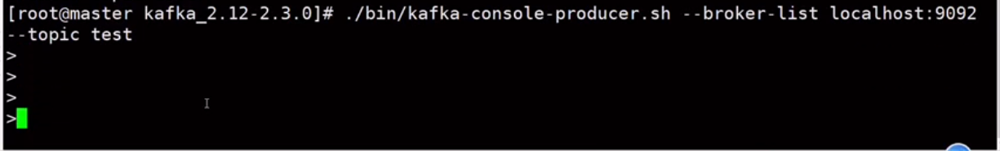
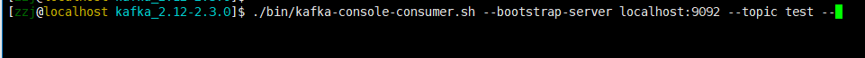
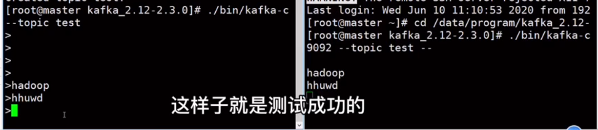

# 安装zookeeper












可以Ctrl+c退出来


---

# kafka的安装





- 另外打开一个命令行窗口，对他进行测试




---

# 测试


```
./bin/kafka-topics.sh --create --zookeeper localhost:2181 --replication-factor 1 --partitions 1 --topic test
```

- 打开一个producer

```
./bin/kafka-console-producer.sh --broker-list localhost:9092 --topic test
```




- 另外一个窗口打开consumer

```
./bin/kafka-console-consumer.sh --bootstrap-server localhost:9092 --topic test --
```





